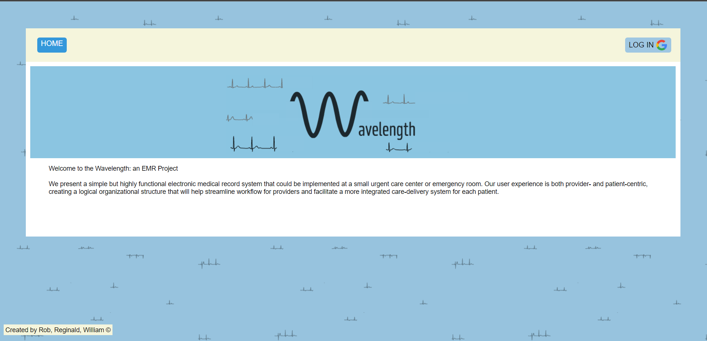
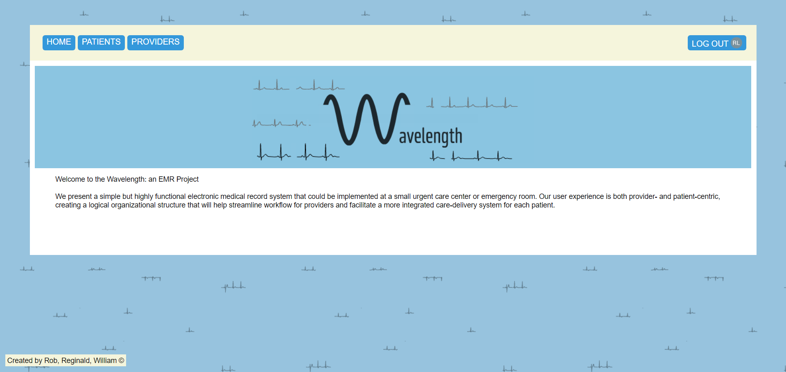

# BRIEF SUMMARY
    The name of the this application is called Wavelength. This web aplication is a simple but highly functional electronic medical record system that could be implemented at a small urgent care center or emergency room. Our user experience is both provider- and patient-centric, creating a logical organizational structure that will help streamline workflow for providers and facilitate a more integrated care-delivery system for each patient.

# USER-EXPERIENCE

### Home Page
    -The user will be greeted by our application's intro page. From there, the user will be able to sign into our application using google authentication. 

Logged out photo

Logged in photo

### Patient Index
    -The user will be able to view all patients admitted in our EMR system record at the patient index page. Patients can also be added from the patient index page, where the user will be taken to a form to fill out all required information on the soon to be admitted patient. The user will also be able to filter patients based on their admission status(admitted or discharged) or all patients on record. If the user selected the "all patients" feature, the index will present all patients on record regradless of admission status. Patients will be highlighted in a light grey tint based on their discharged status( discharged patients will be light grey). Once the patient is admitted, the user will be able to view the patients facesheet by selecting the name of that patient from the index. 

Patient Index w/o Filter

Patient Index Showcase Filter

Patient Index All Patients Filter

    
### Patient Facesheet

    -In the patient's facesheet, the user will be able to view that patients current assigned healthcare providers. the user can add vitals to the patient or delete an already added set of vitals from that patient's facesheet. The patient's facesheet will also have progress notes so the user will be able to witness the last updated progress notes applied. The progress notes will be seperated into 3 sub-categories: Subjective; Objective; Assessment and Plan. The user can select "add progress note" so that the user will be able to add new set of progress notes or the user can view all progress notes which will take the user to a new page to see all associated progress notes. In the patient facesheet, the user can also discharge the patient. Upon discharging the patient you can automatically generate a discharge summary for the patient. This discharge summary is generated using OpenAiAPI.  

Patient's Facesheet showcasing general info on patient   

Patient's Facesheet showcasing recorded vitals on patient.

Adding new set of Vitals to patient

Patient Facesheet showcasing record progress notes on patient

Adding new set of Progress Notes to patient

Patient's Generated Discharge Summary

    -if the user uses the nav bar to navigate to the providers, they will be taken to the providers index. Here, base on the user's    
    administration status, the user will be able to see the list of all current users as well as add new users or edit current users

    -if the user navigates to add users, the user will be able to create a user. The user has the option to allow Administration priviledges to the user. 
    
    -if the user navigated to edit users, they would be able to make changes to the user, such as job title and admin status.

    -if the user clicked on the name of the user/provider, the user will be able to view that user's profile. Within the profile, the user will be able to edit the user(synonumous function as "edit user" at the provider index), unassign current patients, or assign new patients using the drop down and clicking the button "assign patient".

 -Based on the user's administration status certain features will or will not be available to said user. 

# BRIEF SUMMARY
This application is called Wavelength. It is a web application that serves as a simple yet highly functional electronic medical record (EMR) system suitable for implementation in small urgent care centers or emergency rooms. Our user experience is designed to be both provider- and patient-centric, creating a logical organizational structure that streamlines workflows for providers and facilitates a more integrated care-delivery system for each patient.

# USER EXPERIENCE
- Users are greeted by the application's introduction page. They can sign into the application using Google authentication.

## App - Screenshots
Home Page UI Logged out photo

Home Page UI Logged in photo

- Depending on the user's administrative status, certain features will be available or unavailable.

-The patient index page displays all patients recorded in the EMR system. Patients can be added from this page, where a form gathers required information for new admissions. Filtering options based on admission status (admitted or discharged) are available. Choosing "all patients" displays all patients regardless of admission status, with discharged patients shown in a light gray tint.
## App - Screenshots

Patient Index No Filter

- After admitting a patient, users can access the patient's facesheet by selecting the patient's name from the index.

- Within the patient's facesheet, users can view the patient's assigned healthcare providers, add vitals, or delete previously added vital sets. Progress notes are also visible, categorized into Subjective, Objective, and Assessment and Plan sections. Users can add new progress notes or view all existing ones. Discharging a patient generates a discharge summary using OpenAI API.

- Navigating to the providers section in the navigation bar leads to the providers index. Depending on the user's administrative status, the list of all current users can be seen, and new users can be added or existing ones edited.

- The "add users" section allows users to create new user profiles, with the option to grant administrative privileges.

- In the "edit users" section, users can modify user details, including job titles and administrative status.

- Clicking on a user/provider's name displays their profile. Within the profile, users can edit user details (equivalent to "edit user" in the provider index), unassign current patients, or assign new patients by using the dropdown and clicking "assign patient".

# TECHNOLOGIES USED
    -HTML/CSS
    -Node.js
    -mongoose/mongoDB
    -express
    -github
    -google-oauth
 
## Team and Primary/Lead Roles:
    Wavelength: The EMR Project
    
### Roles: 
- frontend - Reggie(Will/Rob)
- backend - Will(reggie/rob)
- git wrangler - Will
- design lead - Rob(Will/reggie)	 
- research / documentation lead - Reggie/Will/Rob

GitHub Pages - [https://github.com/william-hu-codes/electronic-medical-record] 
Website - [https://wavelength-medical-records-50e817316e66.herokuapp.com/?fbclid=IwAR3qqvgpBvcA0vYMgNmVAxtsXeKd3JTlKcfBz8ps_Fxcilj5tG2uiFxbOaw]
